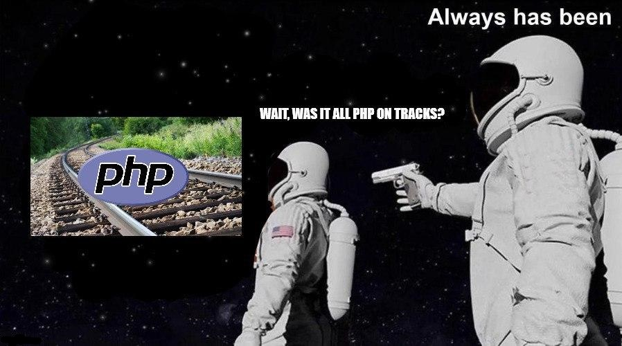

# PHP on Tracks

A rails-inspired PHP MVC framework that works **automagically** ✨



Kudos to [@auirarrazaval](https://github.com/auirarrazaval) for the **awesome** depiction of the framework.

## Usage

To be able to use the framework, it must be run within an apache webserver where the app can use `.htaccess` files.

The minimum configuration is:

```bash
git clone https://github.com/daleal/php-on-tracks.git
cd php-on-tracks
touch .env
```

## Container Solution

In case that you don't fancy mounting an apache webserver in the development process, using containers to simulate the apache webserver is a good idea. [Docker on Tracks](https://github.com/daleal/docker-on-tracks) is a container solution designed to simply work with PHP on Tracks, so it might be worth checking!
